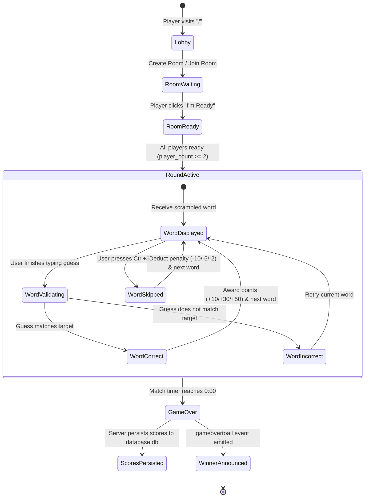
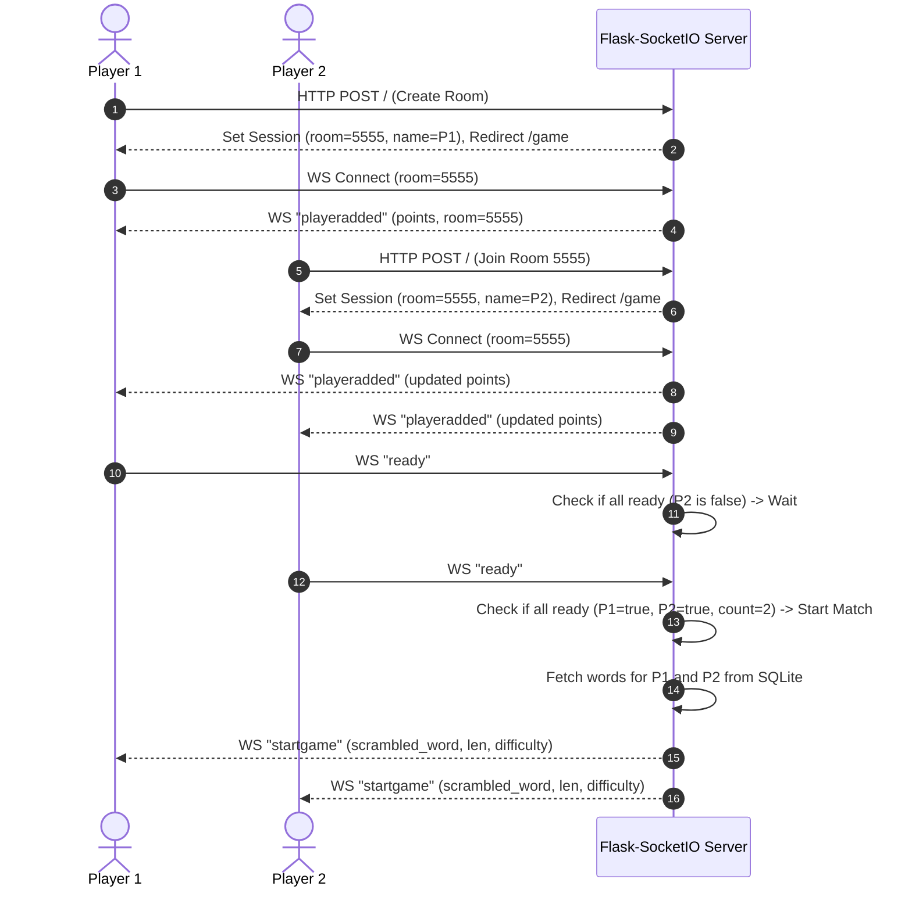
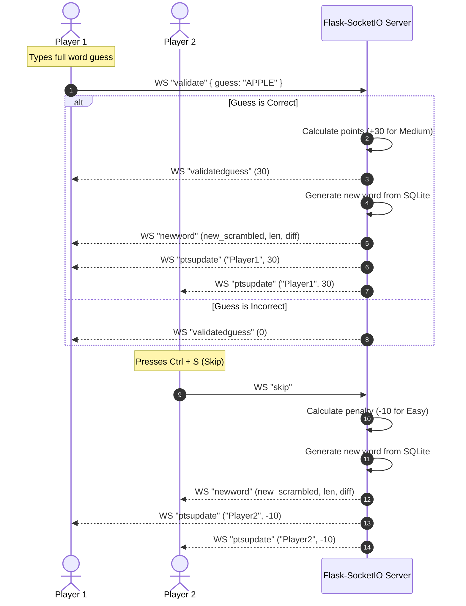
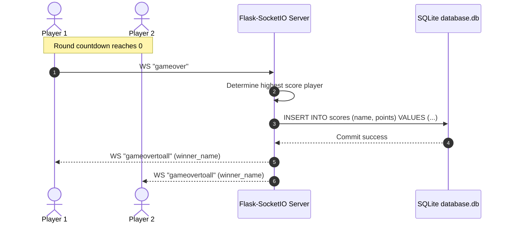

# Scramble Battles - Architecture & Technical Design

This document details the system design, communication protocols, state management, database models, and animation architecture of **Scramble Battles**.

---

## 1. System Architecture Overview

Scramble Battles combines a lightweight Flask server with real-time WebSocket channels managed via Flask-SocketIO. Clients interact with the application over two protocols:
1. **HTTP/REST Protocol**: For landing page delivery, session initiation (room creation/joining), and fetching leaderboard statistics.
2. **WebSocket (Socket.IO) Protocol**: For continuous real-time state synchronization, ready checks, guess validation, score updates, and match termination.

```
                    ┌────────────────────────┐
                    │      Web Browser       │
                    │ (HTML5/GSAP/Howler.js) │
                    └───────────┬────────────┘
                                │
        ┌───────────────────────┴───────────────────────┐
        │                                               │
  HTTP Requests                                   Socket.IO Events
  (GET /, POST /,                                 (connect, ready,
   GET /leaderboard)                               validate, skip, gameover)
        │                                               │
        ▼                                               ▼
┌───────────────────────────────────────────────────────────────┐
│                     Flask-SocketIO Engine                     │
│                  [testgame.py / game.py]                     │
├───────────────────────────────────────────────────────────────┤
│ In-Memory Match State:                                        │
│  - room_codes: { <room_id>: { player_count, players, started }│
│  - points: { <room_id>: { <player_name>: <score> } }          │
│  - readyplayers: { <player_name>: <bool> }                    │
│  - currentword: { <room_id>: { <player_name>: <target_word> } │
├───────────────────────────────────────────────────────────────┤
│ Data Layer (SQLite3):                                         │
│  - `words` table: Word dictionary & difficulty levels         │
│  - `scores` table: Final match scores with timestamps         │
└───────────────────────────────────────────────────────────────┘
```

---

## 2. Match Lifecycle & State Machine

A match moves through distinct phases from creation to game over:



---

## 3. Real-Time WebSocket Event Sequences

### 3.1 Match Setup & Ready Handshake



### 3.2 Gameplay Loop: Guessing, Skipping, and Score Sync



### 3.3 Match Conclusion & Score Persistence



---

## 4. In-Memory State Model

The server keeps real-time room and player states in memory:

```python
room_codes = {
    "1234": {
        "player_count": 2,
        "players": {
            "<sid_1>": "Alice",
            "<sid_2>": "Bob"
        },
        "started": True
    }
}

points = {
    "1234": {
        "Alice": 80,
        "Bob": 50
    }
}

readyplayers = {
    "Alice": True,
    "Bob": True
}

currentword = {
    "1234": {
        "Alice": "elephant",
        "Bob": "banana"
    }
}
```

---

## 5. Database Schema & Data Pipeline

### 5.1 Tables

#### `words` Table
Stores vocabulary entries extracted and filtered from `4000words.csv`:
```sql
CREATE TABLE words (
    id INTEGER PRIMARY KEY,
    word TEXT NOT NULL,
    len INTEGER NOT NULL,
    difficulty TEXT NOT NULL
);
```

#### `scores` Table
Stores historical match scores:
```sql
CREATE TABLE scores (
    id INTEGER PRIMARY KEY,
    name TEXT NOT NULL,
    points INTEGER NOT NULL,
    timestamp DATETIME DEFAULT CURRENT_TIMESTAMP
);
```

### 5.2 Leaderboard Query
The `/leaderboard` endpoint aggregates historical match performance across all games:
```sql
SELECT name, SUM(points) as total_points,
       (SELECT timestamp FROM scores s2 WHERE s2.name = s1.name ORDER BY points DESC LIMIT 1) as peak_time
FROM scores s1
GROUP BY name
ORDER BY total_points DESC;
```

---

## 6. Frontend Animation & Audio Architecture

### 6.1 GSAP MotionPath Border Tracer
The active word input container features an SVG border tracing animation. As the player achieves consecutive correct answers:
- The `streak` counter increases.
- The `streakmul` multiplier scales up.
- The GSAP timeline duration shortens dynamically:
  $$\text{duration} = 4.0 - (\text{streakmul} \times 1.0)$$
- Creating an accelerating tracer effect around the current word.

### 6.2 Anime.js Background Grid
The background renders a dynamic CSS grid of square tiles calculated from `window.innerWidth` and `window.innerHeight`. Anime.js triggers subtle color wave pulses radiating outward from the center grid coordinate on word transitions.

### 6.3 Sound Effects Matrix
Audio cues are preloaded and managed by Howler.js:
- `JeffsJingle.MP3`: Background match soundtrack (loops at 70% volume).
- `ding3.mp3` / `ding5.mp3` / `ding6.mp3`: Randomly sampled success sound effects played on correct answers.
